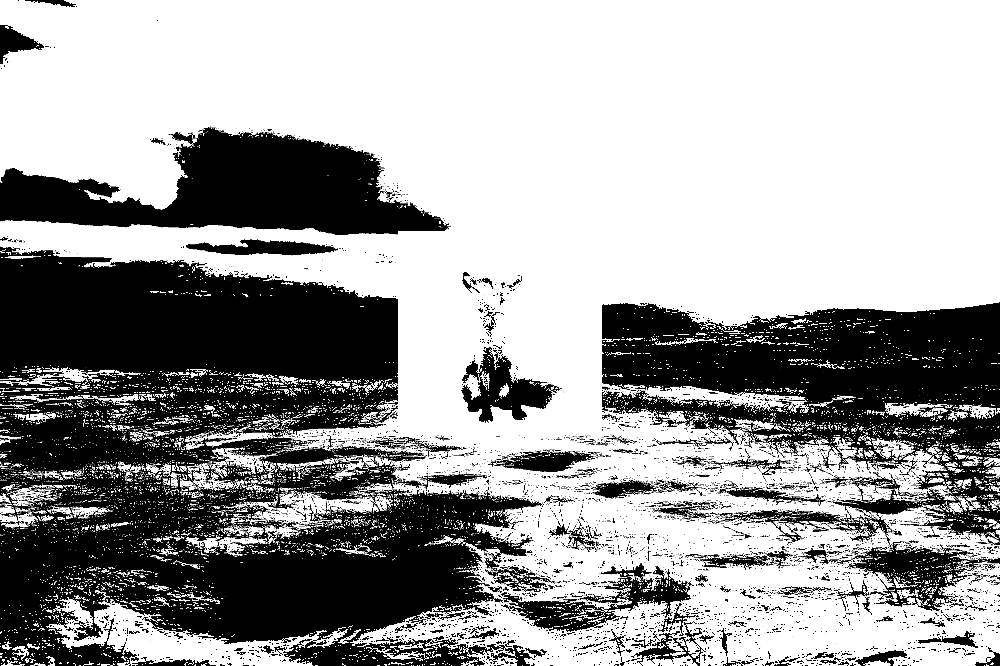

# BMP Image Finder

## Description

This project is designed to find the occurrence of a 1bpp BMP image within another 1bpp BMP image. If the sub-image is found, the program outputs the coordinates of the upper left corner of any one of the occurrences. If the sub-image is not found, the program indicates that it was not found. It is made utilizing x86 assembly. This project was developed on a Linux Ubuntu system as a project for the Computer Architecture (ECOAR) course.

## Installation

To set up the project, simply clone the repository and compile it using the provided Makefile for the desired architecture (32-bit or 64-bit).

```sh
git clone https://github.com/sar-michal/BMP-Image-Finder.git
cd BMP-Image-Finder
make        # For 32-bit version
make -f Makefile64  # For 64-bit version
```

## Usage

The program is run using command-line arguments. It accepts two arguments:
1. The name of the main image file (the image where the second one is going to be looked for).
2. The name of the sub-image file (the image that is being searched for).

Example usage:

```sh
./findimg test_pictures/tundraF.bmp test_pictures/fox.bmp  # For 32-bit version
./findimg64 test_pictures/tundraF.bmp test_pictures/fox.bmp  # For 64-bit version
```

## Testing

You can access the test images by providing their names, such as `test_pictures/tundraF.bmp` and `test_pictures/fox.bmp`.


```sh
Found at 1194, 693  
Main Image - Width: 3000, Height: 2000  
Sub Image - Width: 612, Height: 612
```

## Dependencies

The project does not have any external dependencies beyond a standard C compiler and NASM assembler.
